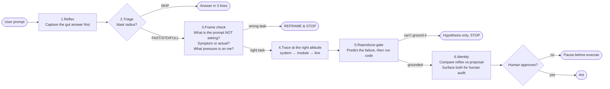
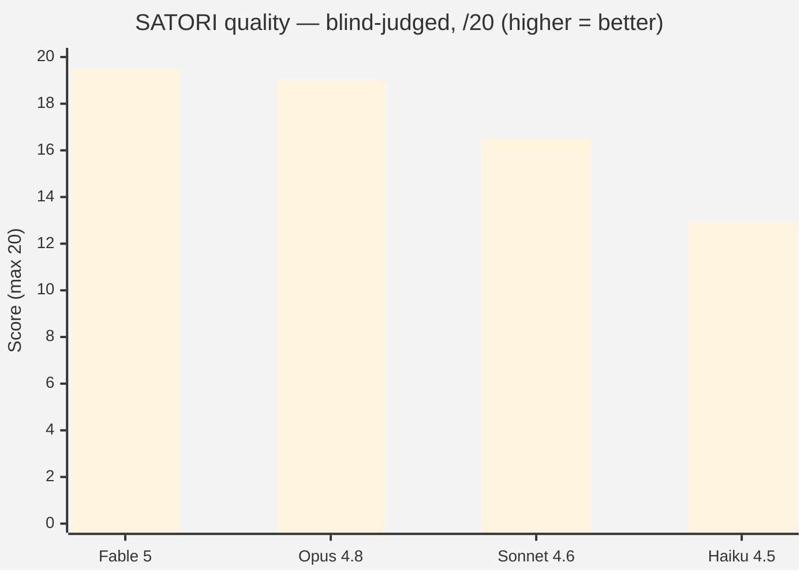
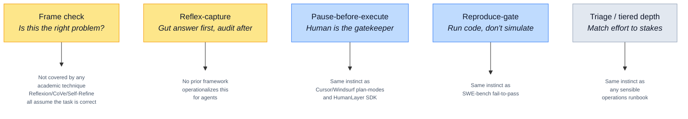

# SATORI

**A pre-commit reflection discipline for AI agents.** Pause. Reframe. Reproduce. Then act.

SATORI is a small markdown file you give an AI coding agent **before** it acts. It makes the agent stop, question whether it's even solving the right problem, verify against reality, and hand the decision back to you — instead of confidently charging down the wrong path.

> **Start here:** [`SATORI.md`](SATORI.md) → paste it as a system prompt or a per-task prefix to your agent. That's it.

---

## Why this exists

AI agents lock onto the first plausible framing. You point them at `dashboard.py` and they patch it — when the bug is in a scheduled job they never opened. You ask "make checkout fast" and they start designing a microservices rewrite — when the real cause was a three-line N+1. They mirror your framing, propose the obvious fix, miss the linked issue one layer up.

The expensive failure isn't the small wrong fix. It's the **tunnel-vision spiral**: an agent burns a fortune in tokens very competently solving something that was never the point, you read the diff, realize the framing is wrong, and you have to wrangle it back and **restart**. The wasted run is sunk; the wrong direction often leaks into your codebase as half-done work you now have to undo.

**The honest cost picture:** SATORI does *not* save tokens on a single run — it costs a little more on a single run, because the agent stops to think before acting. **Over a long project, it saves you the cost of the wrong-direction PRs, the broken deploys, the half-done refactors that need to be torn out, and the restart of every spiral that didn't have a brake on it.** It's the cost of a seatbelt vs. the cost of an accident. We measured this directly: in a head-to-head with no practice file, on a bug report that pushed hard toward a microservices rewrite, the agent with SATORI declined the rewrite, found the small N+1, and shipped a 3-line fix. The agent without it burned tokens enthusiastically refining the wrong answer.

The goal isn't to slow the agent down on every task — it's to **slow it down on the right ones**, by an amount that pays back many times over in avoided rework.

---

## What it actually does — five mechanisms

SATORI isn't "think step by step." It's the specific moves a strong model does **not** make on its own:



1. **Frame check** — *"what is the prompt asking me NOT to consider? Is this the real problem or a symptom?"* If the stated task is the wrong task → reframe and **stop**. (The most distinctive mechanism; nothing in the prior art formalizes it as a mandatory pre-task step.)
2. **Pause-before-execute** — the agent outputs analysis as **text only** and stops. No edits, no commits until *you* approve. **You** are the gatekeeper, not the checklist.
3. **Triage / tiered depth** — a 30-second triage scales reflection (skip / fast / standard / full) to the blast radius. Don't meditate on a typo.
4. **Reproduce-gate** — run code to reproduce the bug before proposing a fix. "Obvious from inspection" is not enough.
5. **Reflex-capture** — write the gut answer **first**, then reason, then compare. Lets you audit what the reflection actually changed (and catch the cases where it changed nothing — that's ritual, not work).

---

## The evidence

Two pieces of data on the front page; the full report (29-trial benchmark + bake-offs) is in [`report.html`](report.html).

### 1. Quality across models (SATORI, blind-judged, June 2026)

Same SATORI file, four models, two tasks (one code, one open-ended design), two trials each, scored blind by two independent judges:



| Model | Code-diagnosis task | Open-design task | Overall |
|---|---:|---:|---:|
| **Fable 5** | 19.25 | **19.75** | **19.5** |
| Opus 4.8 | 19.5 | 18.5 | 19.0 |
| Sonnet 4.6 | 19.0 | 14.0 | 16.5 |
| Haiku 4.5 | 16.0 | 9.75 | 12.9 |

**The headline finding:** the practice is the *floor-raiser*; the model is the *ceiling-setter*. On the code-diagnosis task — a bug report pushing hard toward an expensive rewrite — **8/8 runs resisted the trap, even Haiku**. The frame check works on every model; the wrong-direction restart was prevented across the board. On open-ended design, where there's no ground truth to converge on, model capability dominates and the spread is 10 points.

**Routing guide:** bounded code work → Sonnet 4.6 is the value pick. Open-ended or critical design → Fable 5 or Opus 4.8. SATORI is the floor; the model sets the ceiling.

### 2. The five mechanisms, ordered by what differentiates them



Yellow = genuinely underserved by prior art (the front-of-the-pack contribution). Blue = existing instincts SATORI packages into one loadable file. Grey = sensible-and-shared with most engineering practice. Full prior-art analysis: [`synthesis/prior_art.md`](synthesis/prior_art.md).

---

## Files

```
.
├── README.md              ← you are here
├── SATORI.md              ← the practice — paste into your agent's system prompt
├── report.html            ← interactive evidence report (open in any browser)
├── variants/              ← lighter / heavier alternatives
│   ├── BREATH.md          ← 8-step pause, the foundation. Lightest.
│   ├── INSIGHT.md         ← BREATH + frame check. The first reframing-capable file.
│   └── SATORI_FULL.md     ← Heaviest: every step every time, includes variance ("run twice")
├── benchmarks/            ← replication kit (problems, prompts, results data)
└── synthesis/             ← analysis docs, research log, prior-art comparison
```

**Quick routing among the files:**

| Situation | Use |
|---|---|
| **Default for any non-trivial agent task** | **`SATORI.md`** |
| Lighter foundation if SATORI feels heavy for the task | `variants/BREATH.md` or `variants/INSIGHT.md` |
| Cross-cutting design where you want every step every time | `variants/SATORI_FULL.md` |
| Simple typo / lint / one-line fix | None — let the agent do the work |

---

## Quick start

1. Open [`SATORI.md`](SATORI.md), copy its contents.
2. Paste into your agent as a **system prompt** (recommended) or as a **per-message prefix** before the actual task.
3. The agent will produce analysis as text and **stop** before executing. Read its proposed reflex-vs-meditated delta. Approve or redirect.
4. If you want the agent to skip the pause for a turn (e.g., *"I trust this, go ahead and apply it"*), say so explicitly in that turn.

Works with Claude / GPT / Gemini / open models. The pause-before-execute is a prompt-level contract — in deployments that auto-approve tool calls (Claude Code with auto-approve enabled, unattended agent pipelines), the pause is decorative. Run interactively or configure explicit per-tool approval before relying on SATORI for stake-bearing work.

---

## Prior art — and what's genuinely new

We checked ([`synthesis/prior_art.md`](synthesis/prior_art.md)):

- **Already well-covered, lean on these:** human-in-the-loop infrastructure ([HumanLayer](https://www.humanlayer.dev/), [LangGraph `interrupt()`](https://www.langchain.com/blog/making-it-easier-to-build-human-in-the-loop-agents-with-interrupt)); post-hoc reflection (Reflexion, Self-Refine, AutoGen); anti-sycophancy ([SYCOPHANCY.md](https://sycophancy.md/)); spec-before-code ([GitHub Spec Kit](https://github.com/github/spec-kit)). SATORI is not competing with these — it complements them.
- **Genuinely novel:** the **frame check as a formalized, mandatory pre-task step** (no academic analog found); the **integrated five-mechanism discipline as one loadable markdown** (the combination + delivery format is the gap); **reflex-capture** (no prior framework operationalizes it for agents); and **empirical measurement** of a reasoning discipline via blind-judged bake-offs.

---

## Origin

The name comes from *satori* — the sudden insight in Zen practice, paired with *anapanasati* (mindfulness of breathing) as the seed. Inspired by Alexander Stuart's *"Attempting to teach Claude AI meditation"* (2026). The practice isn't about calm; it's about **not obeying the pull toward the first resolved answer.**

The principle, in one line: *notice the pull, don't obey it.*
