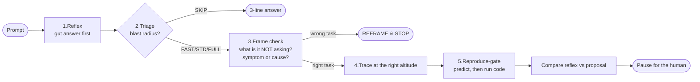
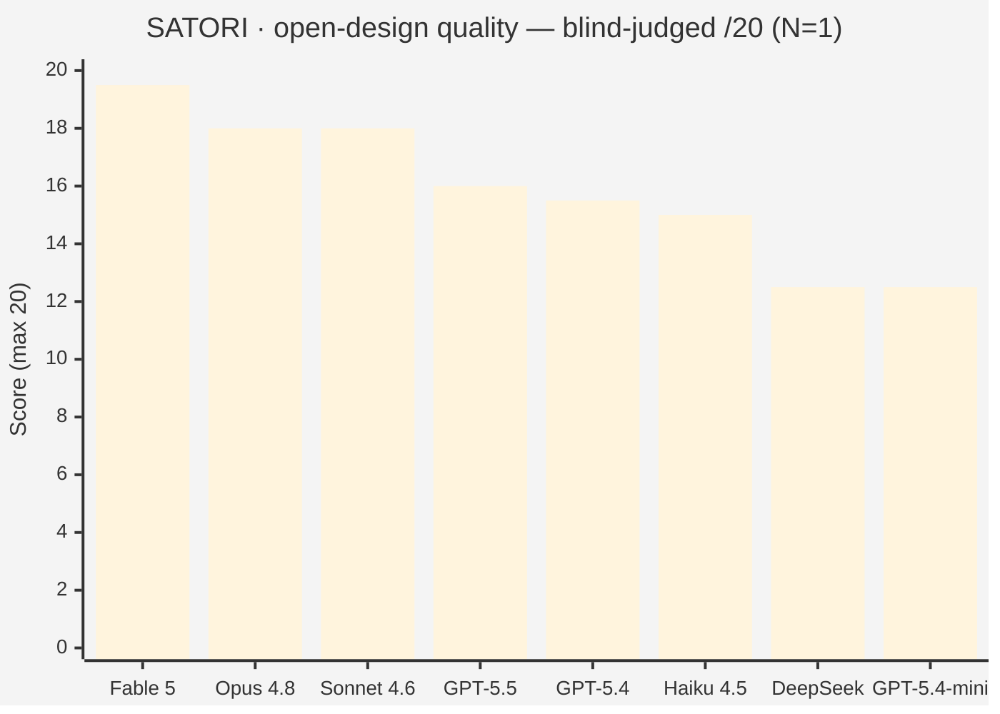
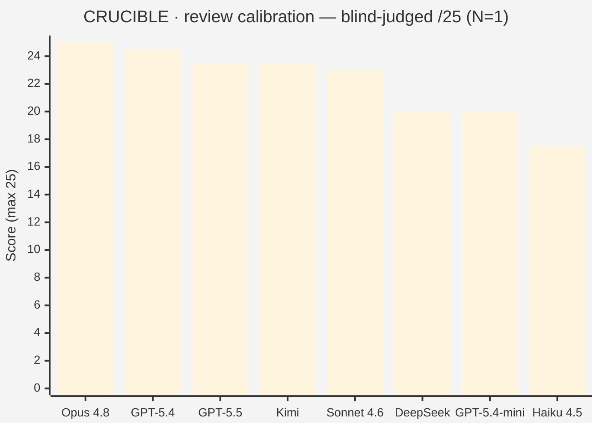

<!-- hero -->


-f59e0b?style=flat-square)


**ANAPANA is a set of small markdown files you give an AI agent _before_ it acts.** They make the model stop, question whether it's solving the *right* problem, check itself against reality, and hand the decision back to you — instead of confidently sprinting down the wrong path.

Five disciplines, one idea: *notice the pull toward the first resolved answer; don't obey it.*

| | Use it when you're… | The move it forces |
|---|---|---|
| 🧭 **SATORI** | **building / deciding** | Pause before committing to a direction — *is this even the right problem?* |
| 🔥 **CRUCIBLE** | **reviewing / red-teaming** | Critique a plan or design adversarially — *without tunnel-vision or noise.* |
| 🪨 **WHETSTONE** | **writing tests** | Write a suite that bites — *oracle from the spec, not the code.* |
| 🪙 **TOUCHSTONE** | **trusting tests** | Assay a green suite — *does it fail when the code is broken, or is it theater?* |
| 🔄 **LIANXI** *(experimental)* | **running a long loop** | Run the four in a cycle until the goal is *genuinely* met. |

---

## Quick start

**Two ways to use ANAPANA. Pick one.**

### Option A — Install as an Agent Skill (recommended)

Installs all five as proper [Agent Skills](https://agentskills.io/) into Claude Code, Codex, Cursor, and any agent that reads the `SKILL.md` standard. Then invoke with a slash command.

```bash
git clone https://github.com/flyingsriracha/Anapana
cd Anapana/skill
./install.sh both        # → ~/.claude/skills/ and ~/.agents/skills/
```

Then, in your agent:

```
/satori      pause and frame before I act
/crucible    adversarially review this design
/whetstone   write tests that actually bite
/touchstone  can I trust these tests?
/lianxi      run this as a disciplined loop
```

Full per-agent install (Claude Code, Codex, Cursor, and how the skills hand off to each other): **[`skill/README.md`](skill/README.md)**.

### Option B — Paste a single file

No install. Copy the discipline you need into your agent as a **system prompt** or per-message prefix:

- Building? → [`SATORI.md`](SATORI.md)
- Reviewing a design? → [`CRUCIBLE.md`](CRUCIBLE.md)
- Writing tests? → [`WHETSTONE.md`](WHETSTONE.md)
- Trusting a test suite? → [`TOUCHSTONE.md`](TOUCHSTONE.md)
- Running an autonomous loop? → [`LIANXI.md`](LIANXI.md)

Either way: the agent produces analysis as text and **stops before executing** — you read it, then approve or redirect. To skip the pause for a turn, say so (*"I trust this, apply it"*).

### Which one do I use?

| Situation | Use |
|---|---|
| Default for any non-trivial agent task | **SATORI** |
| Red-teaming a plan, design, or change | **CRUCIBLE** |
| Writing tests for code that matters | **WHETSTONE** |
| "The tests pass — can we ship?" | **TOUCHSTONE** |
| A long autonomous loop / `/loop` / overnight run | **LIANXI** |
| A typo / lint / one-liner | none — let the agent work |

> Works with Claude / GPT / Gemini / open models. Pause-before-execute is a prompt-level contract — in auto-approve deployments it's decorative, so run interactively (or require per-tool approval) for stake-bearing work.

---

## The problem it's built for

AI agents lock onto the first plausible framing. Point one at `dashboard.py` and it patches it — when the bug lives in a cron job it never opened. Say "make checkout fast" and it starts a microservices rewrite — when the real cause was a three-line N+1. They mirror your wording, ship the obvious fix, and miss the issue one layer up.

The costly failure isn't the small wrong fix — it's the **tunnel-vision spiral**: the agent burns a fortune competently solving the wrong thing, you read the diff, realize the frame was off, and **restart**. ANAPANA is a brake on that spiral. It costs a little more up front, but over a project it saves the wrong-direction PRs, the broken deploys, and the half-done refactors you'd have torn out. A seatbelt, not a speedup.

---

## How the five disciplines work

<details>
<summary><strong>🧭 SATORI — for building</strong></summary>

The five moves a strong model does **not** make on its own:



**Frame check** (is this the right problem?) · **pause-before-execute** (you approve before it acts) · **triage** (match effort to stakes) · **reproduce-gate** (run code, don't simulate) · **reflex-capture** (write the gut answer first, audit what changed).
</details>

<details>
<summary><strong>🔥 CRUCIBLE — for red-teaming</strong></summary>

Calibrated adversarial review — find the real issues, ranked and grounded, without paranoia:


**Whole-system frame first** (anti-tunnel) · **steelman before critique** (anti-negativity) · **blind the framing** (anti-suppression) · **ground + rank every finding** (anti-noise) · **raise scrutiny on auth/crypto/payments** (anti-blindness).
</details>

<details>
<summary><strong>🪙 TOUCHSTONE — for trusting tests</strong></summary>

A green suite is not evidence; *a suite that fails when the code is broken* is. The assay:

- **Integrity gate** — was the green *forced*? (skipped tests, edited runner, loosened asserts)
- **Name the oracle** — for each test, does the **spec** decide pass/fail, or the **code**? (code → tautology)
- **Golden Oracle** — hand-derive one exact value from the *spec*, **grounded in reality**, not the code.
- **Assay by mutation** — break the code; the suite must die. Report kill-rate, not coverage. The tell of a captured suite: *it stays green when you swap in the spec-correct code.*
</details>

<details>
<summary><strong>🪨 WHETSTONE — for writing tests</strong></summary>

The constructive other half — how to write a suite that bites in the first place: source the oracle from the spec (not the code), ground it in reality, see it **fail first**, cover the boundaries, mock only the I/O edge, and **prove it kills mutated code** before you trust it. Reach for it when TOUCHSTONE reveals theater — rebuild, don't patch the green.
</details>

<details>
<summary><strong>🔄 LIANXI — for running the loop (experimental)</strong></summary>

The loop discipline (练习, *practice through repetition*) — for `/loop` and long autonomous sessions. It runs the other four as per-iteration *kernels* inside one circle: **orient** wide (frame the whole system, harvest every buried user grievance as a real requirement, write the goal down verbatim), then each pass **pick one bounded item → build → check** (WHETSTONE/TOUCHSTONE on the tests; a calibrated CRUCIBLE-light red-team) **→ record the honest delta** — zooming back out every few iterations. A re-read **ledger** survives context compaction; the only exits are **PROVEN / STUCK / BUDGET** — never "tests pass," and never by weakening a test to reach green.
</details>

---

## Does it actually work? (measured)

Short version: **the practice is the floor-raiser; the model is the ceiling-setter.** On findable-answer tasks the frame check works on every model tested; on open-ended design, model capability dominates. Full data and honest caveats below.

<details>
<summary><strong>How models behave under ANAPANA (9 models, blind dual-judge)</strong></summary>

We ran the **same files across 9 models**, blind-judged by two independent models, on two tasks: an open-ended **design** problem (SATORI) and an adversarial **review** of a planted-bug spec (CRUCIBLE).





| Model | Family | SATORI /20 | CRUCIBLE /25 | Behavior under ANAPANA |
|---|---|---:|---:|---|
| **Fable 5** | Claude | **19.5** 🏆 | — | Deepest, broadest designs; reframes hardest. *(Design score from a prior identical run.)* |
| **Opus 4.8** | Claude | 18.0 | **25.0** 🏆 | Best all-rounder available. Visibly *corrects its own reflex* mid-review. |
| **Sonnet 4.6** | Claude | 18.0 | 23.0 | Reliable and concise; the value pick. |
| **GPT-5.5** | Foundry | 16.0 | 23.5 | Strongest non-Claude designer. Needs a large output budget or returns *nothing*. |
| **GPT-5.4** | Foundry | 15.5 | **24.5** 🥈 | Excellent calibrated reviewer; mid-pack on open design. |
| **Haiku 4.5** | Claude | 15.0 | 17.5 | Reaches the right verdict but **calibration slips** — over-flags. |
| **Kimi** | Foundry | —\* | 23.5 | Strong reviewer with enough output budget (\*design run cut off). |
| **DeepSeek** | Foundry | 12.5 | 20.0 | Thorough but less incisive. |
| **GPT-5.4-mini** | Foundry | 12.5 | 20.0 | Competent, lighter depth; the budget option. |

**Two findings that matter:**
- **The practice is the floor-raiser; the model is the ceiling-setter.** On findable-answer tasks (a bug report baiting an expensive rewrite), **8/8 runs resisted the trap — even Haiku**. On open-ended design, model capability dominates (~10-point spread).
- **Calibration generalizes; raw design quality doesn't.** CRUCIBLE's calibration travels across families — GPT-5.4 nearly ties Opus. Design scores stay capability-gated.

> **Does the discipline itself do anything?** CRUCIBLE beat an uncalibrated "be thorough and adversarial" red-team by **+5.75/25** in a blind dual-judge head-to-head; both judges ranked *both* CRUCIBLE runs above *both* baseline runs. Full data: [`benchmarks/`](benchmarks/) ([SATORI v7](benchmarks/v7_models/SCORING.md) · [CRUCIBLE v8](benchmarks/v8_crucible_models/SCORING.md) · [vs baseline](benchmarks/v6_crucible/SCORING.md)).
>
> *Caveats: cross-model rounds are **N=1, one task each** — directional, not definitive. Judges are themselves contestants; mitigated by blind anonymization, spread-scoring, and dual judges.*
</details>

<details>
<summary><strong>Does the test pair help? (TOUCHSTONE vs baseline)</strong></summary>

Same blind dual-judge method on the **test-trust pair** — four rounds, each a *green* suite (passing, ~100% coverage) hiding a real bug; same model in both arms.

| Round | Solver | Hidden bug | TOUCHSTONE | Baseline | Gap |
|---|---|---|---:|---:|---:|
| Obvious gamed suite | Sonnet | tautological + skipped spec test | **24.5** | 21.0 | +3.5 |
| Subtle gotcha | Sonnet | `round()` banker's vs spec half-up | **24.25** | 20.5 | +3.75 |
| Subtle gotcha | Haiku | same | **24.5** | 18.5 | +6.0 |
| Non-famous boundary | Sonnet+Haiku | tier off-by-one | **23.4** | 19.0 | +4.4 |

TOUCHSTONE ranked above baseline in **all 8 judge cards, never reversed**.

- **Rigor, not discovery.** A strong baseline already *finds* the bug; the gap is in *proof*. The decisive move: **mutate the code to the spec-correct version and show the suite still passes** — its oracle was the code, not the spec. → [`benchmarks/v9_touchstone`](benchmarks/v9_touchstone/SCORING.md).
- **We could not manufacture a "catches what baseline misses" gap** — likely contamination (synthetic bugs are famous patterns a strong model recalls).
</details>

<details>
<summary><strong>The four as a system, and the loop (LIANXI) test</strong></summary>

We ran all four disciplines canary-style (blind solvers, no knowledge of the bugs) against a real Python project's *pre-existing* bugs. Each discipline owns a different **bug class**:

| Bug class | Best caught by | TOUCHSTONE alone |
|---|---|---|
| Internal contradiction | any discipline | ✓ |
| External-reality mismatch | **SATORI** (reality-grounding) | **ratified it** |
| Security / secret leak | **CRUCIBLE** | out of scope |
| Test theater / tautology | **TOUCHSTONE** | ✓ |

On the external-reality bug, *every* test-writing arm — TOUCHSTONE included — **ratified** it, because the agents' own notion of the requirement was wrong. **That's the case for the system:** a golden oracle is only as true as the spec behind it — feed it a spec that SATORI/CRUCIBLE already pressure-tested. → [`benchmarks/v10_system`](benchmarks/v10_system/SCORING.md).

**Does LIANXI beat a bare loop?** On a single-session loop with a strong model, they **tied on outcome** — the bare loop already framed the system and harvested grievances. LIANXI measurably added **rigor and auditability**: red-first proof, an independent-eyes sub-agent audit that caught two real gaps, and an auditable verbatim-goal ledger. Its core reason-for-being — resisting goal-drift across *compaction* — a single-session test can't reach, so it remains **unproven**. Shipped honestly as experimental. → [`benchmarks/v11_lianxi`](benchmarks/v11_lianxi/SCORING.md).

*Caveats: n=2/arm, blind dual-judge, judges are themselves models. "No discovery gap" results are partly benchmark-contamination — treat the catch matrix as a well-grounded hypothesis.*
</details>

<details>
<summary><strong>Proof in production (real engagements, anonymized)</strong></summary>

Each had already passed a *thorough* human-plus-agent review **before** ANAPANA ran.

| Real engagement | A thorough pass already produced | What the practice changed | Result |
|---|---|---|---|
| A **43-finding fix campaign** | "all 43 verified — here's the plan" | re-asked *"are these fixes correct?"* → the headline fix would ship green and save **$0** | 4 broken fixes + unlisted bugs caught; **4/4** new claims verified |
| A service **OOM-killed ~47 nights** | 4 co-equal fixes (one risky) | isolated the **one-line keystone**; deferred the risk | **4 → 1**: a 47-night crash fixed by one argument |
| *"Order this screen's data better"* | a one-screen tweak | reframed: ~8 paths feed **62%-stub duplicate** data to expensive LLMs | **1 → 8**: a scalpel became the systemic fix |
</details>

<details>
<summary><strong>What we tried and rejected</strong></summary>

Honest negative result: we tried to make SATORI fight bias harder with a research-backed "deliberation loop" and benchmarked it **blind before adopting**. It earned **0 gain** across four views. Baseline SATORI already resisted these; we kept the file unchanged. [`benchmarks/v5_subtle/RESULTS.md`](benchmarks/v5_subtle/RESULTS.md) · [`synthesis/research_cot_debias.md`](synthesis/research_cot_debias.md).
</details>

---

## Repo layout

```
skill/          ← installable Agent Skills (SKILL.md) — see skill/README.md
SATORI.md       ← build — pause before committing to a direction
CRUCIBLE.md     ← red-team — calibrated adversarial review
WHETSTONE.md    ← write tests — a suite that bites, oracle from the spec
TOUCHSTONE.md   ← trust tests — assay a green suite for theater
LIANXI.md       ← the loop — run the four in a cycle (experimental)
report.html     ← interactive evidence report (open in any browser)
benchmarks/     ← every round's tasks, raw model outputs, and scoring
synthesis/      ← research log, prior-art analysis, the CoT/debias writeup
```

---

## License

Split-licensed (SPDX: **`MIT AND CC-BY-4.0`**):

- **Prose / content** — every `SKILL.md`, the discipline files, and all documentation — under [**CC-BY-4.0**](skill/LICENSE-CC-BY-4.0). Use, adapt, and share (including commercially) with attribution.
- **Code** — `install.sh` and any scripts — under [**MIT**](skill/LICENSE-MIT).

Each `SKILL.md` carries a `license: CC-BY-4.0` field so attribution travels with the file when installed. Details: [`skill/LICENSE`](skill/LICENSE).

---

## Prior art, and what's new

We checked ([`synthesis/prior_art.md`](synthesis/prior_art.md)). **Well-covered, lean on it:** human-in-the-loop infra ([HumanLayer](https://www.humanlayer.dev/), [LangGraph `interrupt()`](https://www.langchain.com/blog/making-it-easier-to-build-human-in-the-loop-agents-with-interrupt)); post-hoc reflection (Reflexion, Self-Refine); spec-before-code ([Spec Kit](https://github.com/github/spec-kit)); mutation and property-based testing. **Genuinely new:** the **frame check** as a mandatory pre-task step; **reflex-capture** for agents; **calibrated adversarial review** (CRUCIBLE); the **mutation-as-proof test assay** (TOUCHSTONE) plus the **spec-grounded Golden Oracle with a reality gate** (WHETSTONE); and **empirical, blind-judged measurement** across models.

## Origin

The name pairs *satori* — the sudden insight of Zen practice — with *anapanasati*, mindfulness of breathing. Inspired by Alexander Stuart's *"Attempting to teach Claude AI meditation"* (2026). The practice isn't about calm; it's about **not obeying the pull toward the first resolved answer.** One line: *notice the pull, don't obey it.*
