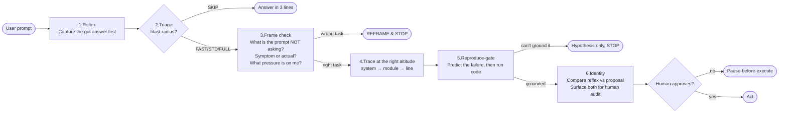
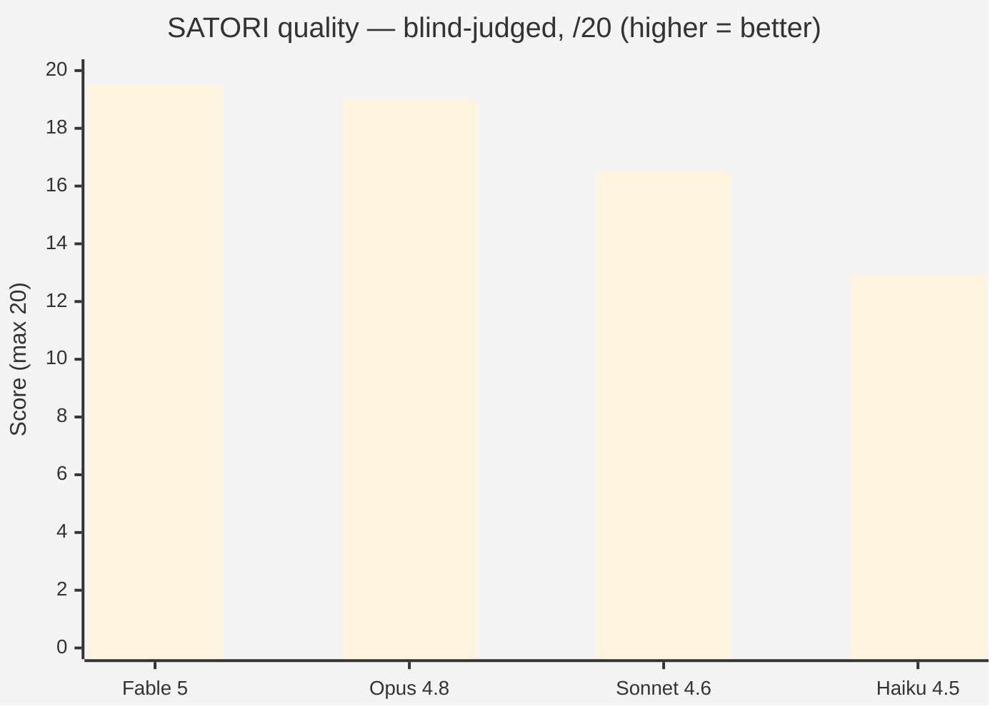
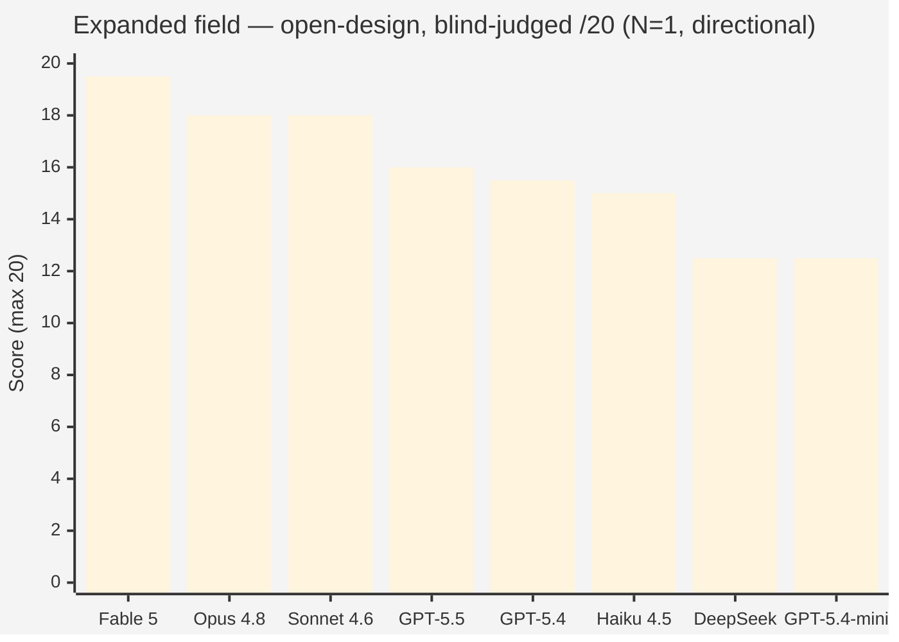
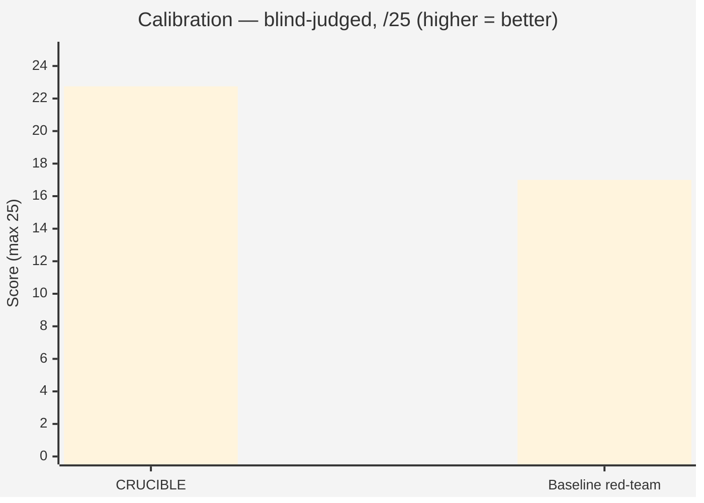
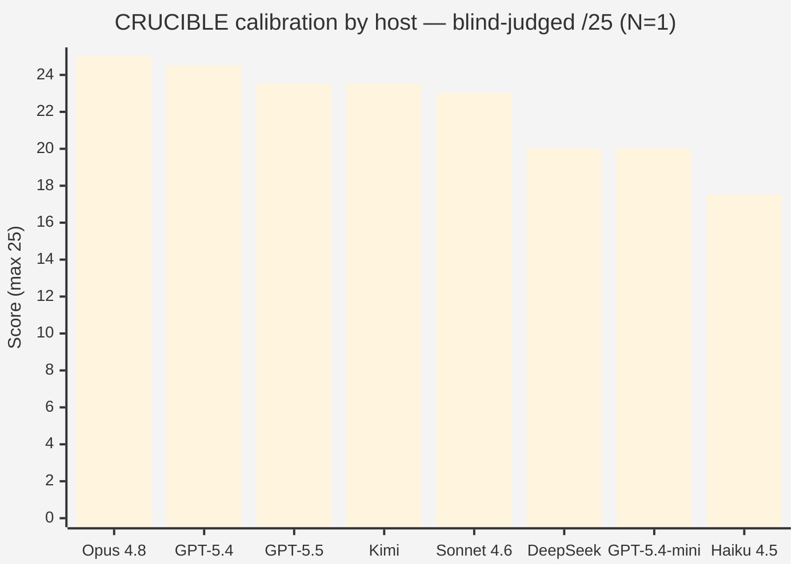

<!-- hero -->


**A pre-commit reflection discipline for AI agents.** Small markdown files you give an agent **before** it acts — so it stops, questions whether it's solving the *right* problem, verifies against reality, and hands the decision back to you, instead of confidently charging down the wrong path.

This repo ships **two** practices, both benchmark-backed:

| | For | One line |
|---|---|---|
| 🧭 **[`SATORI.md`](SATORI.md)** | **Building** | Pause before you commit to a direction. Notice the pull, don't obey it. |
| 🔥 **[`CRUCIBLE.md`](CRUCIBLE.md)** | **Red-teaming** | Critique a plan/design/code adversarially — without tunnel-visioning on attacks or drowning the signal. |

> **Start here:** paste [`SATORI.md`](SATORI.md) into your agent as a system prompt or per-task prefix. That's it. Reviewing someone's design? Use [`CRUCIBLE.md`](CRUCIBLE.md) instead.

### At a glance

| | | |
|---|---|---|
| **Caught in production** | `$0 fix` | a fix that would've passed its tests and saved nothing |
| **Best SATORI host** | `Fable 5 · 19.5/20` | blind-judged, 4-model field |
| **CRUCIBLE vs baseline** | `+5.75/25` | calibrated red-team beats "just be thorough" |
| **Its new claims** | `4/4 verified` | spec corrections confirmed against code |
| **Measured over** | `29 trials` | 3 benchmarks + bake-offs + 4-model head-to-head |

---

## Why this exists

AI agents lock onto the first plausible framing. You point them at `dashboard.py` and they patch it — when the bug is in a scheduled job they never opened. You ask "make checkout fast" and they start designing a microservices rewrite — when the real cause was a three-line N+1. They mirror your framing, propose the obvious fix, miss the linked issue one layer up.

The expensive failure isn't the small wrong fix. It's the **tunnel-vision spiral**: an agent burns a fortune in tokens very competently solving something that was never the point, you read the diff, realize the framing is wrong, and you have to wrangle it back and **restart**. The wasted run is sunk; the wrong direction often leaks into your codebase as half-done work you now have to undo.

**The honest cost picture:** SATORI does *not* save tokens on a single run — it costs a little more, because the agent stops to think first. **Over a long project it saves the wrong-direction PRs, the broken deploys, the half-done refactors torn out later, and the restart of every spiral that had no brake.** It's a seatbelt, not a speedup. The goal isn't to slow the agent on every task — it's to **slow it on the right ones**, by an amount that pays back many times over in avoided rework.

---

## What SATORI does — five mechanisms

SATORI isn't "think step by step." It's the specific moves a strong model does **not** make on its own:



1. **Frame check** — *"what is the prompt asking me NOT to consider? Is this the real problem or a symptom?"* If the stated task is the wrong task → reframe and **stop**. (The most distinctive mechanism; nothing in the prior art formalizes it as a mandatory pre-task step.)
2. **Pause-before-execute** — the agent outputs analysis as **text only** and stops. No edits, no commits until *you* approve. **You** are the gatekeeper, not the checklist.
3. **Triage / tiered depth** — a 30-second triage scales reflection (skip / fast / standard / full) to the blast radius. Don't meditate on a typo.
4. **Reproduce-gate** — run code to reproduce the bug before proposing a fix. "Obvious from inspection" is not enough.
5. **Reflex-capture** — write the gut answer **first**, then reason, then compare. Lets you audit what the reflection actually changed (and catch the cases where it changed nothing — that's ritual, not work).

---

## Shown, not told — three production cases

The most convincing evidence isn't a benchmark — it's what the practice caught on real systems. These are real engineering engagements *(anonymized)*. What makes them fair: **each had already been through a thorough pass** — sub-agents, verification, a written plan — *before* the practice ran. Full writeups are in [`report.html`](report.html).

| Real engagement | A thorough pass already produced | What the practice changed | Result |
|---|---|---|---|
| A **43-finding fix campaign** on a production agent | "all 43 verified — here's the phased plan" | re-asked *"are these fixes correct?"* → the headline fix would pass its tests, ship green, and save **$0** (a 20-hour freshness window a 24-hour job can never meet) | 4 broken fixes + unlisted bugs caught before merge; **4/4** new claims verified vs code |
| A nightly service **OOM-killed ~47 nights** running | a bundle of **4 co-equal fixes**, incl. a risky day-one change | isolated the **one-line keystone**; deferred the risky change behind an evidence gate | **4 → 1**: a 47-night crash fixed by one argument |
| *"Order the news on this screen better"* | a one-screen tweak (an earlier bolt-on had made it worse) | reframed: ~8 code paths feed **62%-stub, near-duplicate** data to expensive LLMs | **1 → 8**: a scalpel became the systemic fix it actually needed |

> Is it just a longer document? The practitioners held it to three falsifiable tests: **did it change decisions** (not just prose), **do its new claims survive verification**, and **did it produce disconfirmations**. All three, yes — details in the report.

---

## The evidence

### 1. SATORI across models — Fable 5 leads the field 🏆

Same SATORI file, four models, two tasks (one code, one open-ended design), two trials each, scored **blind by two independent judges**:



| Model | Code-diagnosis | Open-design | Overall |
|---|---:|---:|---:|
| 🏆 **Fable 5** | 19.25 | **19.75** | **19.5** |
| Opus 4.8 | 19.5 | 18.5 | 19.0 |
| Sonnet 4.6 | 19.0 | 14.0 | 16.5 |
| Haiku 4.5 | 16.0 | 9.75 | 12.9 |

> **🏆 Fable 5 is the strongest SATORI host (19.5/20)** — edging Opus 4.8, and its lead concentrates exactly where model capability matters most: **open-ended design (19.75)**, where there's no ground truth to converge on. Judges called its work *"the single most complete, precise, and practically useful answer"* and *"senior design judgment."*

**The headline finding:** the practice is the *floor-raiser*; the model is the *ceiling-setter*. On the code task — a bug report pushing hard toward an expensive rewrite — **8/8 runs resisted the trap, even Haiku**. The frame check works on every model. On open-ended design, model capability dominates and the spread is 10 points. **Routing:** bounded code → Sonnet 4.6 (the value pick); open-ended / critical design → Fable 5 or Opus 4.8.

**Expanded field** — same SATORI file across **9 models** on the open-design task (the 4 Claude models + five via Azure Foundry: GPT-5.5, GPT-5.4, GPT-5.4-mini, DeepSeek, Kimi), one fresh blind dual-judge pool:



> 🏆 **Fable 5 still tops the field (19.5).** The Claude frontier (Fable / Opus / Sonnet) leads; **GPT-5.5 is the strongest non-Claude host (16.0)**, ahead of Haiku 4.5. *Caveats: N=1, one task, a fresh pool (not comparable to the 4-model numbers above); Kimi's run was truncated and is excluded pending a re-run. Full data: [`benchmarks/v7_models/SCORING.md`](benchmarks/v7_models/SCORING.md).*

### 2. CRUCIBLE — the red-team practice 🔥

SATORI is for *building*. **CRUCIBLE** is its sibling for *critiquing* — a discipline an agent loads before adversarially reviewing a plan, design, or change. It was built to fix a specific failure: red teams that **tunnel-vision onto the named attack, flood low-value nitpicks, and lose the whole-system view** (and the opposite failure — going soft because something looks "already approved").

```mermaid
flowchart LR
    A([Artifact to review]) --> B[1.Whole-system frame<br/>goals · failure categories · scope]
    B --> C[2.Steelman<br/>strongest case FOR it, first]
    C --> D[3.Blind the framing<br/>ignore 'already approved']
    D --> E[4.Premortem<br/>it failed — 5 reasons, 3+ categories]
    E --> F[5.Turn on yourself<br/>what did I over/under-weight?]
    F --> G[6.Ground · rank · bound<br/>Block / Sprint / Backlog / Hypothesis]
    G --> H[7.Verdict<br/>sound / needs-changes / unsound]
    H --> P([Pause for human])
```



In a blind dual-judge benchmark, CRUCIBLE beat an uncalibrated *"be thorough and adversarial, find everything"* red-team:



> **The win was calibration, not recall.** Both judges ranked *both* CRUCIBLE runs above *both* baseline runs (**+5.75/25**). All four runs *found* the same real bugs — they separated on how findings were **scoped, ranked, and presented**: CRUCIBLE tiered them and kept the critical bug as the clear blocker; the baseline produced 17–20-item near-flat walls with speculative items inflated to HIGH ("textbook over-flagger," per a judge). That noise — not missed bugs — is what makes red-team passes feel *"too aggressive."* Details: [`benchmarks/v6_crucible/SCORING.md`](benchmarks/v6_crucible/SCORING.md).

**CRUCIBLE across the model field** — same file, 8 hosts red-teaming the same artifact, one blind dual-judge pool, scored on *calibration* /25:



> Unlike open-design (where the Claude frontier dominates), **calibrated review travels across model families** — Opus 4.8 tops it but **GPT-5.4 is a near-co-leader (24.5)**, and GPT-5.5/Kimi edge Sonnet. The outlier is **Haiku 4.5, last (17.5)** — the only model to take the scope-creep/rewrite bait and over-flag. Every model still reached the right verdict; the spread is in *staying calibrated.* Data: [`benchmarks/v8_crucible_models/SCORING.md`](benchmarks/v8_crucible_models/SCORING.md).

### 3. What we tested and *rejected* (a negative result)

We tried to make SATORI fight bias harder by adding a research-backed "deliberation loop" (step-back, counterfactual probe, isolated re-derivation, compare-and-converge) and benchmarked it **blind before adopting**. It didn't earn its place: **0 bias-resistance gain across four views** — catchable bias, subtle bias (Simpson's-paradox data, a correct function with a wrong test), and a weak model. Baseline SATORI already resists these biases; its frame check + reflex-capture + reproduce-gate were doing the work. We kept the file unchanged. Details: [`benchmarks/v5_subtle/RESULTS.md`](benchmarks/v5_subtle/RESULTS.md) · [`synthesis/research_cot_debias.md`](synthesis/research_cot_debias.md).

---

## Files & routing

```
.
├── SATORI.md      ← the practice (build) — paste into your agent's system prompt
├── CRUCIBLE.md    ← the red-team practice (critique) — adversarial review
├── report.html    ← interactive evidence report (open in any browser)
├── variants/      ← BREATH (lightest) · INSIGHT (+ frame check) · SATORI_FULL (heaviest)
├── benchmarks/    ← replication kit (problems, prompts, results, scoring)
└── synthesis/     ← analysis docs, research log, prior-art comparison
```

| Situation | Use |
|---|---|
| **Default for any non-trivial agent task** | **`SATORI.md`** |
| **Adversarially reviewing / red-teaming a plan, design, or change** | **`CRUCIBLE.md`** |
| Lighter foundation if SATORI feels heavy | `variants/BREATH.md` or `variants/INSIGHT.md` |
| Cross-cutting design where you want every step every time | `variants/SATORI_FULL.md` |
| Simple typo / lint / one-line fix | None — let the agent do the work |

---

## Quick start

1. Open [`SATORI.md`](SATORI.md) (or [`CRUCIBLE.md`](CRUCIBLE.md) for review work), copy its contents.
2. Paste into your agent as a **system prompt** (recommended) or a **per-message prefix**.
3. The agent produces analysis as text and **stops** before executing. Read its reflex-vs-result delta (SATORI) or its ranked verdict (CRUCIBLE). Approve or redirect.
4. To skip the pause for a turn, say so explicitly (e.g. *"I trust this, go ahead and apply it"*).

Works with Claude / GPT / Gemini / open models. Pause-before-execute is a prompt-level contract — in deployments that auto-approve tool calls it's decorative, so run interactively (or configure per-tool approval) for stake-bearing work.

---

## Prior art — and what's genuinely new

We checked ([`synthesis/prior_art.md`](synthesis/prior_art.md)):

- **Already well-covered, lean on these:** human-in-the-loop infra ([HumanLayer](https://www.humanlayer.dev/), [LangGraph `interrupt()`](https://www.langchain.com/blog/making-it-easier-to-build-human-in-the-loop-agents-with-interrupt)); post-hoc reflection (Reflexion, Self-Refine, AutoGen); anti-sycophancy; spec-before-code ([GitHub Spec Kit](https://github.com/github/spec-kit)). SATORI complements these, it doesn't compete.
- **Genuinely novel:** the **frame check as a formalized, mandatory pre-task step** (no academic analog found); the **integrated discipline as one loadable markdown**; **reflex-capture** for agents; **calibrated adversarial review** (CRUCIBLE); and **empirical measurement** of reasoning disciplines via blind-judged bake-offs.

---

## Origin

The name comes from *satori* — the sudden insight in Zen practice — paired with *anapanasati* (mindfulness of breathing) as the seed. Inspired by Alexander Stuart's *"Attempting to teach Claude AI meditation"* (2026). The practice isn't about calm; it's about **not obeying the pull toward the first resolved answer.**

The principle, in one line: *notice the pull, don't obey it.*
