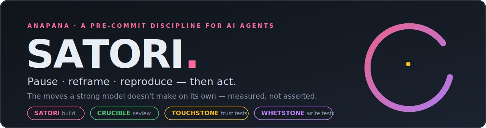
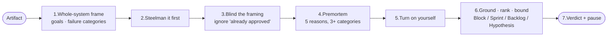
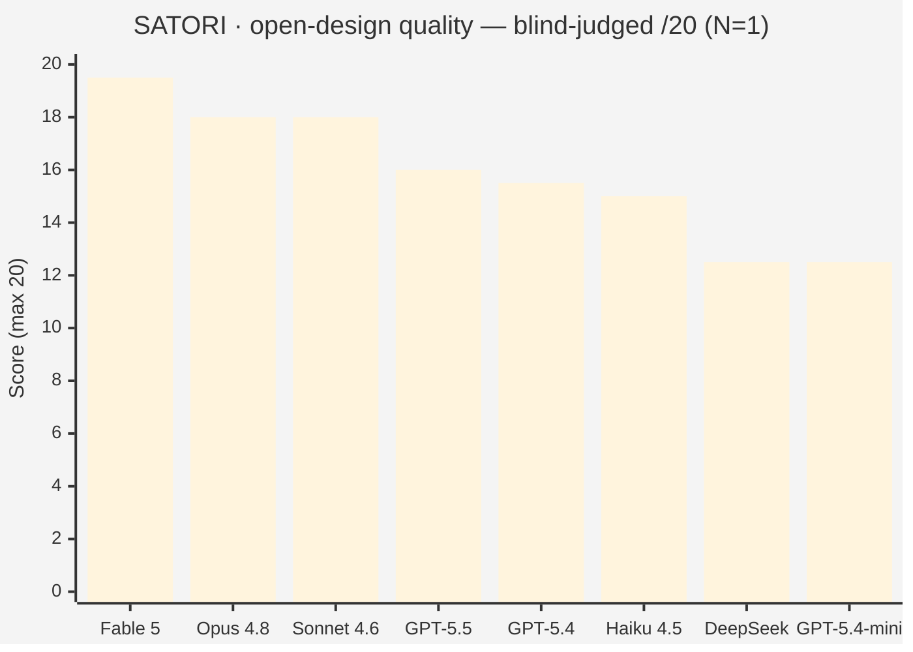
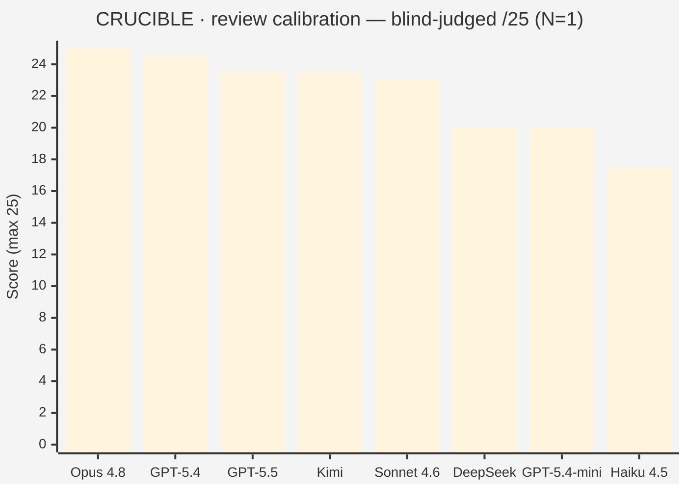

<!-- hero -->



**ANAPANA is a set of small markdown files you give an AI agent _before_ it acts.** They make the model stop, question whether it's solving the *right* problem, check itself against reality, and hand the decision back to you — instead of confidently sprinting down the wrong path. **Four disciplines that compose into one pipeline** — each measured against live models:

| | For | The move it forces |
|---|---|---|
| 🧭 **[`SATORI.md`](SATORI.md)** | **Building** | Pause before you commit to a direction — *is this even the right problem?* |
| 🔥 **[`CRUCIBLE.md`](CRUCIBLE.md)** | **Red-teaming** | Critique a plan/design/code adversarially — *without tunnel-visioning or drowning the signal.* |
| 🪙 **[`TOUCHSTONE.md`](TOUCHSTONE.md)** | **Trusting tests** | Assay a green suite — *does it fail when the code is broken, or is it theater?* |
| 🪨 **[`WHETSTONE.md`](WHETSTONE.md)** | **Writing tests** | Write a suite that bites — *oracle from the spec, not the code; prove it kills broken code.* |

They chain in the natural order of work: **SATORI** (before you build) → **CRUCIBLE** (review the change) → **WHETSTONE** (write the tests) → **TOUCHSTONE** (assay the green before you trust it).

> **Start here:** paste [`SATORI.md`](SATORI.md) into your agent as a system prompt or per-task prefix. Reviewing someone's design? Use [`CRUCIBLE.md`](CRUCIBLE.md). Trusting a test suite? [`TOUCHSTONE.md`](TOUCHSTONE.md). Writing one? [`WHETSTONE.md`](WHETSTONE.md). Use one, or run the whole pipeline.

---

## The problem it's built for

AI agents lock onto the first plausible framing. Point one at `dashboard.py` and it patches it — when the bug lives in a cron job it never opened. Say "make checkout fast" and it starts a microservices rewrite — when the real cause was a three-line N+1. They mirror your wording, ship the obvious fix, and miss the issue one layer up.

The costly failure isn't the small wrong fix — it's the **tunnel-vision spiral**: the agent burns a fortune competently solving the wrong thing, you read the diff, realize the frame was off, and **restart**. ANAPANA is a brake on that spiral. It doesn't make a single run cheaper — it costs a little more up front — but over a project it saves the wrong-direction PRs, the broken deploys, and the half-done refactors you'd have torn out. A seatbelt, not a speedup. The point is to slow the agent down **on the right tasks**, by an amount that pays back many times over.

---

## Four disciplines, one idea

All four run on the same principle — *notice the pull toward the first resolved answer; don't obey it* — applied across the lifecycle. SATORI and CRUCIBLE are shown in full below; TOUCHSTONE and WHETSTONE (the test-trust pair) follow.

### 🧭 SATORI — for building
The five moves a strong model does **not** make on its own:


**Frame check** (is this the right problem?) · **pause-before-execute** (you approve before it acts) · **triage** (match effort to stakes) · **reproduce-gate** (run code, don't simulate) · **reflex-capture** (write the gut answer first, audit what changed).

### 🔥 CRUCIBLE — for red-teaming
Calibrated adversarial review — find the real issues, ranked and grounded, without paranoia:



**Whole-system frame first** (anti-tunnel) · **steelman before critique** (anti-negativity) · **blind the framing** (anti-suppression) · **ground + rank every finding** (anti-noise) · **raise scrutiny on auth/crypto/payments** (anti-blindness).

### 🪙 TOUCHSTONE — for trusting tests
A green suite is not evidence; *a suite that fails when the code is broken* is. The assay:

- **Integrity gate** — was the green *forced*? (skipped tests, edited runner, loosened asserts)
- **Name the oracle** — for each test, does the **spec** decide pass/fail, or the **code**? (code → tautology)
- **Golden Oracle** — hand-derive one exact value from the *spec*, **grounded in reality**, not the code.
- **Assay by mutation** — break the code; the suite must die. Report kill-rate, not coverage. The tell of a captured suite: *it stays green when you swap in the spec-correct code.*

### 🪨 WHETSTONE — for writing tests
The constructive other half — how to write a suite that bites in the first place: source the oracle from the spec (not the code), ground it in reality, see it **fail first**, cover the boundaries, mock only the I/O edge, and **prove it kills mutated code** before you trust it. Reach for it when TOUCHSTONE reveals theater — rebuild, don't patch the green.

---

## How models behave under ANAPANA

We ran the **same files across 9 models**, blind-judged by two independent models, on two tasks: an open-ended **design** problem (SATORI) and an adversarial **review** of a planted-bug spec (CRUCIBLE). Two things fall out — *what each model scores*, and *how it behaves*.

**Design quality (SATORI) — capability-gated.** The Claude frontier dominates open-ended work; the new hosts land mid-field.



**Review calibration (CRUCIBLE) — travels across model families.** Much tighter field; a non-Claude model nearly tops it, and the smallest Claude lands last.



### Per-model profile

| Model | Family | SATORI design /20 | CRUCIBLE review /25 | Behavior under ANAPANA |
|---|---|---:|---:|---|
| **Fable 5** | Claude | **19.5** 🏆 | — | Deepest, broadest designs; reframes hardest; "senior design judgment." *(Unavailable live — design score from a prior identical run.)* |
| **Opus 4.8** | Claude | 18.0 | **25.0** 🏆 | The best all-rounder available. Sharpest framing critiques; visibly *corrects its own reflex* mid-review. Perfect calibration. |
| **Sonnet 4.6** | Claude | 18.0 | 23.0 | Reliable and concise; names tensions cleanly and ranks them. The value pick. |
| **GPT-5.5** | Foundry | 16.0 | 23.5 | Strongest non-Claude designer; a strong reviewer. A reasoning model — needs a large output budget or it returns *nothing*. |
| **GPT-5.4** | Foundry | 15.5 | **24.5** 🥈 | Excellent calibrated reviewer — essentially matches the Claude frontier on review; mid-pack on open design. |
| **Haiku 4.5** | Claude | 15.0 | 17.5 | Reaches the right verdict but **calibration slips**: over-flags and took the scope-creep/rewrite bait. The practice keeps it correct, not concise. |
| **Kimi** | Foundry | —\* | 23.5 | Strong reviewer when given enough output budget; truncates if the cap is too low (\*its design run was cut off and excluded). |
| **DeepSeek** | Foundry | 12.5 | 20.0 | Thorough but less incisive; solid mid-tier on both. |
| **GPT-5.4-mini** | Foundry | 12.5 | 20.0 | Competent with lighter depth; the budget option. |

### The two findings that matter

- **The practice is the floor-raiser; the model is the ceiling-setter.** On *findable-answer* tasks (a bug report baiting an expensive rewrite), **8/8 runs resisted the trap — even Haiku**. The frame check works on every model. On *open-ended* design, where there's no ground truth to converge on, model capability dominates and the spread is ~10 points.
- **Calibration generalizes; raw design quality doesn't.** SATORI's design scores are capability-gated (Claude frontier on top). But CRUCIBLE's *calibration* discipline travels — GPT-5.4 nearly ties Opus, GPT-5.5/Kimi beat Sonnet, and the differentiator at the bottom isn't recall (everyone found the bugs) but **staying calibrated** — which is exactly where Haiku, the smallest, slips.

> **Does the discipline actually do anything?** Yes — measured directly. CRUCIBLE beat an uncalibrated "be thorough and adversarial" red-team by **+5.75/25** in a blind dual-judge head-to-head; both judges ranked *both* CRUCIBLE runs above *both* baseline runs. The baseline found the same bugs but buried them in 17–20-item flat walls — the "too aggressive" noise CRUCIBLE is built to remove. Full data: [`benchmarks/`](benchmarks/) ([SATORI v7](benchmarks/v7_models/SCORING.md) · [CRUCIBLE v8](benchmarks/v8_crucible_models/SCORING.md) · [CRUCIBLE vs baseline](benchmarks/v6_crucible/SCORING.md)).
>
> *Caveats, stated plainly: the cross-model rounds are **N=1, one task each** — directional, not definitive (the rigorous validation is the N=2 dual-judge work in `benchmarks/`). Judges are themselves contestants; mitigated by blind anonymization, spread-scoring, and dual judges — and the top results were corroborated across both.*

---

## Does the test pair actually help? (measured)

Same blind dual-judge method, now on the **test-trust pair**. **TOUCHSTONE vs a baseline that just reviews the tests** — four rounds, each a *green* suite (passing, ~100% coverage) hiding a real bug; same model in both arms, so the discipline is the only variable.

| Round | Solver | Hidden bug | TOUCHSTONE | Baseline | Gap |
|---|---|---|---:|---:|---:|
| Obvious gamed suite | Sonnet | tautological + a skipped spec test | **24.5** | 21.0 | +3.5 |
| Subtle (famous gotcha) | Sonnet | `round()` banker's vs spec half-up | **24.25** | 20.5 | +3.75 |
| Subtle (famous gotcha) | Haiku | same | **24.5** | 18.5 | +6.0 |
| Non-famous boundary | Sonnet+Haiku | tier off-by-one | **23.4** | 19.0 | +4.4 |

TOUCHSTONE ranked above baseline in **all 8 judge cards, never reversed**. Its score is **model- and bug-stable (~24)**; the baseline's drops with model strength — so the discipline lifts a *weaker* model the most.

**Two honest findings:**
- **Rigor, not discovery.** A strong baseline already *finds* the bug; the entire measured gap is in *proof*. The decisive move both judges singled out every round: **mutate the code to the spec-correct version and show the suite still passes** — i.e. its oracle was the code, not the spec. A gamed suite's tell isn't that it's red; it's that it stays green for the *correct* answer too. → [`benchmarks/v9_touchstone`](benchmarks/v9_touchstone/SCORING.md).
- **We could not manufacture a "catches what baseline misses" gap** across three bug types × two model strengths — likely a *contamination* effect (the synthetic bugs are famous patterns a strong model recalls).

**The four as a system — on a real project.** We ran all four disciplines canary-style (blind solvers, no knowledge of the bugs) against a real Python project's *pre-existing* bugs — nothing planted. Each discipline owns a different **bug class**:

| Bug class | Best caught by | TOUCHSTONE alone |
|---|---|---|
| Internal contradiction (output contradicts its own spec) | any discipline | ✓ |
| External-reality mismatch (wrong assumption about the real world) | **SATORI** (reality-grounding) | **ratified it** |
| Security / secret leak | **CRUCIBLE** (adversarial review) | out of scope |
| Test theater / tautology | **TOUCHSTONE** | ✓ |

On the external-reality bug, *every* test-writing arm — TOUCHSTONE included — **ratified** it, because the agents' own notion of the requirement was wrong, so their oracle mirrored the blind spot. **That's the case for the system:** a golden oracle is only as true as the spec behind it — feed it a spec that SATORI/CRUCIBLE already pressure-tested. → [`benchmarks/v10_system`](benchmarks/v10_system/SCORING.md) · [`FRAMEWORK.md`](benchmarks/v10_system/FRAMEWORK.md).

> *Caveats, plainly: n=2/arm, blind dual-judge, judges are themselves models (mitigated by anonymization + spread-scoring + two judges). And the "no discovery gap" results are partly a benchmark-contamination artifact — famous bug classes a strong model recalls — so treat the scenario-shaped catch matrix as a well-grounded hypothesis pending more contamination-resistant runs. [`CANARY_METHODOLOGY`](benchmarks/v10_system/CANARY_METHODOLOGY.md).*

---

## Proof in production

Benchmarks are one thing; here's what the practice caught on real systems (anonymized). Each had already passed a *thorough* human-plus-agent review **before** ANAPANA ran — that's what makes them fair.

| Real engagement | A thorough pass already produced | What the practice changed | Result |
|---|---|---|---|
| A **43-finding fix campaign** | "all 43 verified — here's the plan" | re-asked *"are these fixes correct?"* → the headline fix would pass its tests, ship green, and save **$0** (a 20h window a 24h job can't meet) | 4 broken fixes + unlisted bugs caught; **4/4** new claims verified vs code |
| A service **OOM-killed ~47 nights** | a bundle of 4 co-equal fixes (one risky) | isolated the **one-line keystone**; deferred the risk behind a gate | **4 → 1**: a 47-night crash fixed by one argument |
| *"Order this screen's data better"* | a one-screen tweak | reframed: ~8 paths feed **62%-stub duplicate** data to expensive LLMs | **1 → 8**: a scalpel became the systemic fix |

---

## What we tried and *rejected*

Honest negative result: we tried to make SATORI fight bias harder with a research-backed "deliberation loop" (step-back, counterfactual probe, isolated re-derivation, compare-and-converge) and benchmarked it **blind before adopting**. It earned **0 gain** across four views — catchable bias, subtle bias, and a weak model. Baseline SATORI already resisted these; we kept the file unchanged. [`benchmarks/v5_subtle/RESULTS.md`](benchmarks/v5_subtle/RESULTS.md) · [`synthesis/research_cot_debias.md`](synthesis/research_cot_debias.md).

---

## Use it

```
SATORI.md      ← build — pause before committing to a direction
CRUCIBLE.md    ← red-team — calibrated adversarial review
WHETSTONE.md   ← write tests — a suite that bites, oracle from the spec
TOUCHSTONE.md  ← trust tests — assay a green suite for theater
report.html    ← interactive evidence report (open in any browser)
benchmarks/    ← every round's tasks, raw model outputs, and scoring (incl. v9 TOUCHSTONE, v10 system)
synthesis/     ← research log, prior-art analysis, the CoT/debias writeup
```

1. Copy [`SATORI.md`](SATORI.md) (or [`CRUCIBLE.md`](CRUCIBLE.md) for review work) into your agent as a **system prompt** or per-message prefix.
2. It produces analysis as text and **stops** before executing — read the reflex-vs-result delta (SATORI) or the ranked verdict (CRUCIBLE), then approve or redirect.
3. To skip the pause for a turn, say so (*"I trust this, apply it"*).

| Situation | Use |
|---|---|
| Default for any non-trivial agent task | **`SATORI.md`** |
| Red-teaming a plan, design, or change | **`CRUCIBLE.md`** |
| Writing tests for code that matters | **`WHETSTONE.md`** |
| "The tests pass — can we ship?" | **`TOUCHSTONE.md`** |
| A typo / lint / one-liner | none — let the agent work |

Works with Claude / GPT / Gemini / open models. Pause-before-execute is a prompt-level contract — in auto-approve deployments it's decorative, so run interactively (or require per-tool approval) for stake-bearing work.

---

## Prior art, and what's new

We checked ([`synthesis/prior_art.md`](synthesis/prior_art.md)). **Well-covered, lean on it:** human-in-the-loop infra ([HumanLayer](https://www.humanlayer.dev/), [LangGraph `interrupt()`](https://www.langchain.com/blog/making-it-easier-to-build-human-in-the-loop-agents-with-interrupt)); post-hoc reflection (Reflexion, Self-Refine); spec-before-code ([Spec Kit](https://github.com/github/spec-kit)); mutation testing and property-based testing as established fields (we stand on them). **Genuinely new:** the **frame check** as a mandatory pre-task step (no academic analog); **reflex-capture** for agents; **calibrated adversarial review** (CRUCIBLE); the **mutation-as-proof test assay** that catches a captured suite by its own green (TOUCHSTONE), plus the **spec-grounded Golden Oracle with a reality gate** (WHETSTONE); and **empirical, blind-judged measurement** of all of it across models.

## Origin

The name pairs *satori* — the sudden insight of Zen practice — with *anapanasati*, mindfulness of breathing. Inspired by Alexander Stuart's *"Attempting to teach Claude AI meditation"* (2026). The practice isn't about calm; it's about **not obeying the pull toward the first resolved answer.** One line: *notice the pull, don't obey it.*
